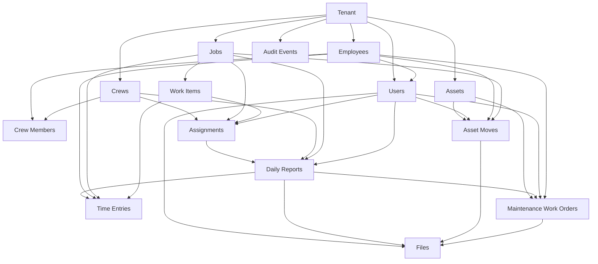
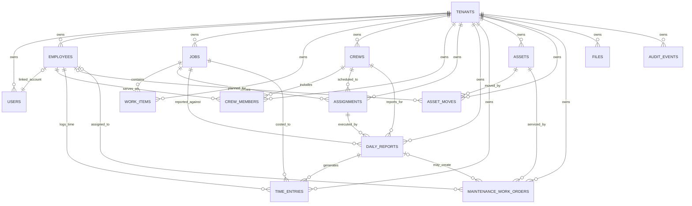

# MVP Entity Diagram

This view is intentionally simplified so a business user can understand the main parent/child relationships without reading SQL.

## Business View

## Parent And Child Summary

### Tenant
- Parent of every operational record.

### Users
- Optional child of `Employees`.
- Parent of created assignments, submitted reports, requested asset moves, opened work orders, uploaded files, and audit events.

### Employees
- Parent of crew memberships, time entries, assigned drivers on asset moves, assigned workers on work orders, and optional linked users.

### Jobs
- Parent of work items, assignments, daily reports, time entries, and some asset state and move references.

### Work Items
- Child of jobs.
- Optional child reference for assignments and time entries.

### Crews
- Parent of crew memberships, assignments, and daily reports.

### Assignments
- Child of crews and jobs.
- Parent of daily reports.

### Daily Reports
- Child of assignments.
- Parent of time entries.
- Optional parent of maintenance work orders and attached files.

### Assets
- Parent of asset moves and maintenance work orders.

### Asset Moves
- Child of assets.
- Can also reference jobs and employees.
- Can have attached files.

### Maintenance Work Orders
- Child of assets.
- May also be created from a daily report.
- Can have attached files.

### Files
- Generic attachment records used across daily reports, asset moves, and maintenance work orders.

### Audit Events
- Standalone trace records that point back to the entity that changed.

## Technical ER View

